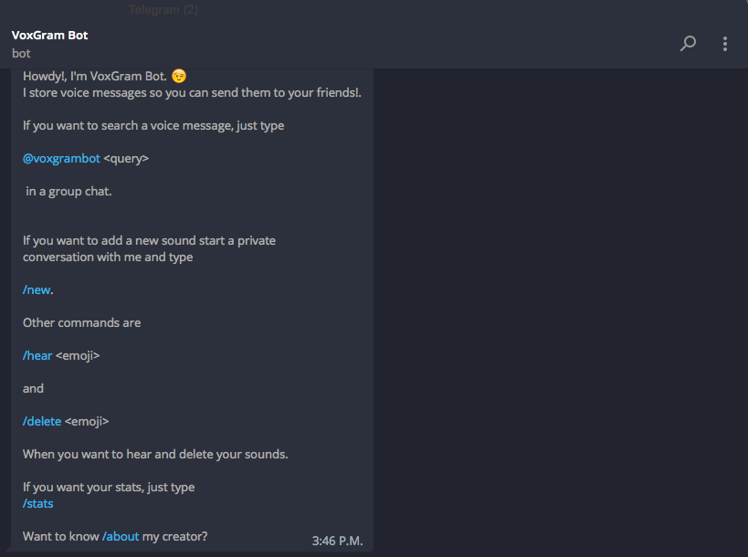

# Voxgram
A simple bot for Telegram using Processwire and Python.

This bot is a proof of concept using Python 3.x with Telegram Bot Framework [https://python-telegram-bot.org](https://python-telegram-bot.org)
And ProcessWire [https://www.processwire.com](https://www.processwire.com) for the Backend.

This bot enables saving voice audios on Telegram and send them back using emojis or keywords in a simple search inside the chat.

You could try the app here
[telegram.me/voxgrambot](http://telegram.me/voxgrambot)

## Installation

- Get your own bot token with the botfater [telegram.me/botfather](http://telegram.me/botfather)

- Grab a fresh copy of Processwire and inside the *"site"* directory copy the contents of the repo. Be sure to change *htaccess.txt* to *.htaccess* if you use Apache Server.

- Upload *voxgram.sql* to your MySQL server using PHPMyAdmin or another tool.

- The admin Url is */dojo* User is *ninja* password is *secret*

- Go to */voxgrambot/config.py* and configure the server, telegram token, user and password values.

- Go to */templates/_init.php* and configure the same user and password as *config.py*

## Running
Be sure that you have all the packages required. And virtual enviroments configured with Python 3. [http://docs.python-guide.org/en/latest/dev/virtualenvs/](http://docs.python-guide.org/en/latest/dev/virtualenvs/)

Go to */voxgrambot/* and execute.

`$ source ./env/bin/activate`

`$ pip install requirements.txt`

`$ python voxgram.py`

If all is good then you can now chat with your bot and save you audio files inside the ProcessWire Backend.

## Licence
[MIT](LICENSE)

Made with <i class="fa fa-heart">&#9829;</i> by <a href="http://ninjas.cl" target="_blank">Ninjas</a>.